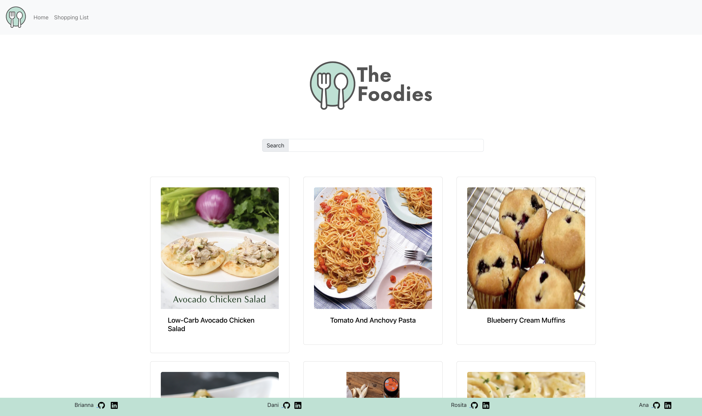
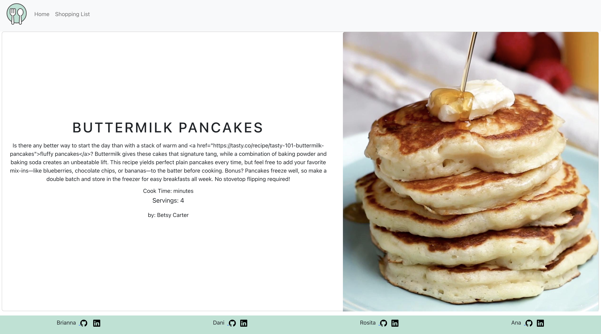
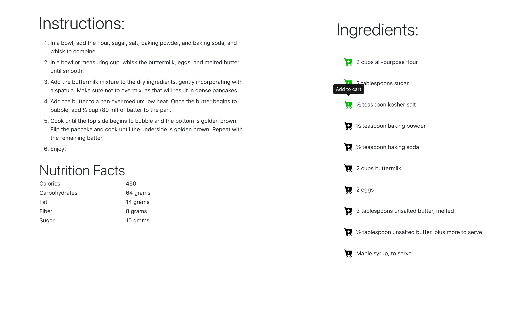
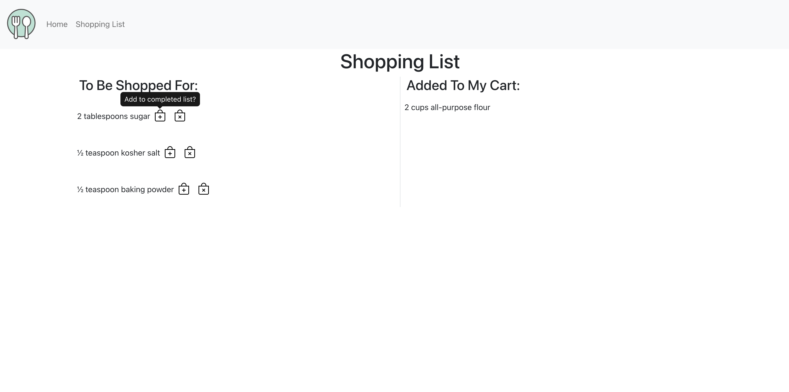

## Project #1
### Overview
The Foodies app is a comprehensive platform designed to simplify the process of discovering, organizing, and preparing recipes. By fetching recipes from the Tasty API and displaying them alongside captivating images, Foodies aims to inspire users to explore new culinary experiences. With a user-friendly interface, the app allows users to effortlessly add ingredients to a shopping list, streamlining the meal planning and grocery shopping process. 

**What are the users?**  
The users of the Foodies app are likely individuals who have an interest in cooking and trying out new recipes. They could be amateur cooks, food enthusiasts, or anyone looking for creative meal ideas.

**What job does it form for them?**  
The Foodies app simplifies the process of discovering new recipes and managing their ingredients. It acts as a convenient platform for users to explore a variety of dishes, save ingredients to a shopping list, and access the detailed recipe information easily.

**What inspired you to make it?**  
We all love good food and love to experiment with different dishes. We wanted to create a user-friendly solution for people who enjoy cooking but often struggle with finding and organizing recipes. This app helps to centralize recipe discovery and management, thereby simplifying the cooking experience for users. 

**What features are the most important?**    
- Fetching and displaying recipes from the Tasty API with images and clickable titles leading to the respective recipes.
Enabling users to add ingredients to a shopping list for easy reference.
Providing a well-designed single recipe page view that showcases a picture of the food and a list of ingredients, making it easy for users to follow and prepare the dish.

**Personal Contribution**  
I created and styled the single Recipe view Page and styling. 

**Here are a few screenshots**  
### Home Page 
  
### Single Recipe View
 
 
### Shopping
 

## Technologies
- React 18
- JavaScript
- Include dependencies and versions
- React-Bootstrap V5
- Node v14 and above

## Competencies
### JF 4.3
- List the full text of the job function first
- Describe a situation where you demonstrated  this job function.
- Summarize the actions you took to accomplish the goal. 
- Emphasize the results of this action for your team or your learning. 
- Connect the competentcy to this project

### JF XX.XX
- List the full text of the job function first
- Describe a situation where you demonstrated  this job function.
- Summarize the actions you took to accomplish the goal. 
- Emphasize the results of this action for your team or your learning. 
- Connect the competentcy to this project