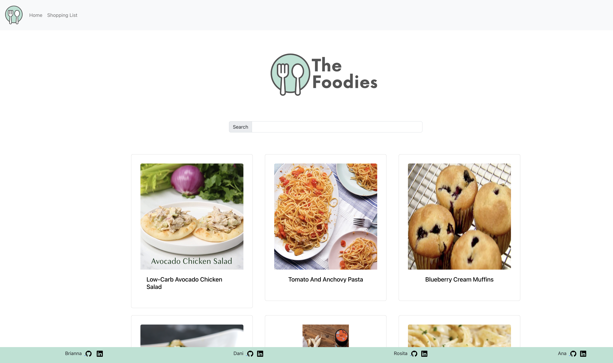
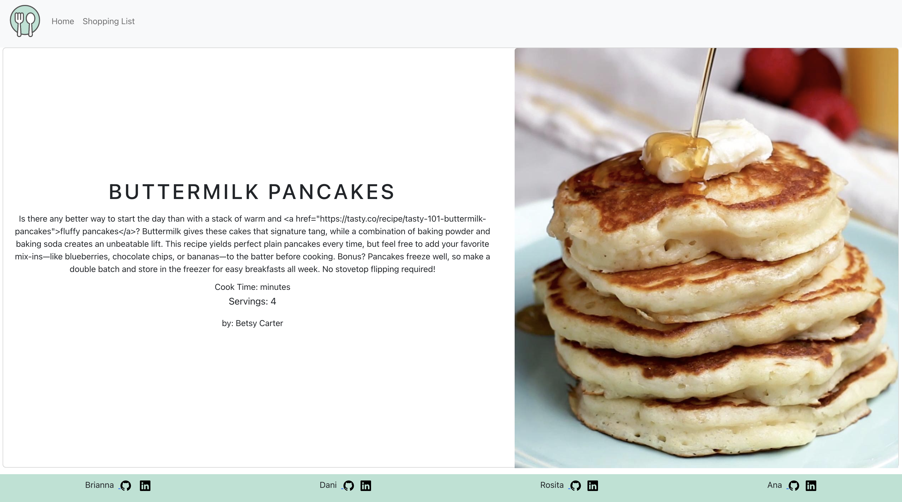
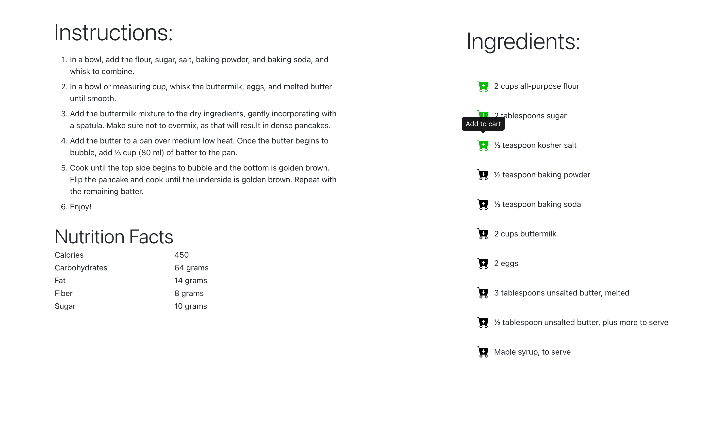
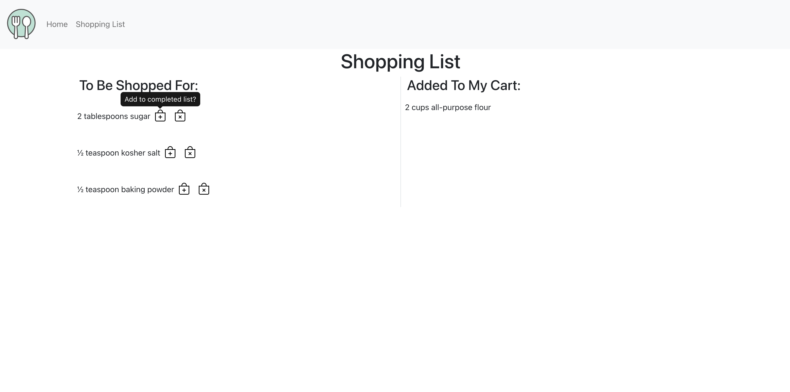

## Project #1
### Overview
The Foodies app is a comprehensive platform designed to simplify the process of discovering, organizing, and preparing recipes. By fetching recipes from the Tasty API and displaying them alongside captivating images, Foodies aims to inspire users to explore new culinary experiences. With a user-friendly interface, the app allows users to effortlessly add ingredients to a shopping list, streamlining the meal planning and grocery shopping process. 

### Home Page 
  
### Single Recipe View
 
 
### Shopping
 

**What are the users?**  
The users of the Foodies app are likely individuals who have an interest in cooking and trying out new recipes. They could be amateur cooks, food enthusiasts, or anyone looking for creative meal ideas.

**What job does it form for them?**  
The Foodies app simplifies the process of discovering new recipes and managing their ingredients. It acts as a convenient platform for users to explore a variety of dishes, save ingredients to a shopping list, and access the detailed recipe information easily.

**What inspired you to make it?**  
We all love good food and love to experiment with different dishes. We wanted to create a user-friendly solution for people who enjoy cooking but often struggle with finding and organizing recipes. This app helps to centralize recipe discovery and management, thereby simplifying the cooking experience for users. 

**What features are the most important?**    
Fetching and displaying recipes from the Tasty API with images and clickable titles leading to the respective recipes.
Enabling users to add ingredients to a shopping list for easy reference.
Providing a well-designed single recipe page view that showcases a picture of the food and a list of ingredients, making it easy for users to follow and prepare the dish.

## Personal Contribution   
_I created and styled the single Recipe view Page._  
**S** - The application needed to have the ability to view one single recipe at a time. I created a single recipe view page that displays the recipe image, title, and ingredients. Also a button was needed to allow a user to add the ingredients to a shopping list.   
**T** - Use React and Bootstrap to allow a user to view a single page. Create a container that would hold the recipe image, title, and ingredients. Also create a button that would allow a user to add the ingredients to a shopping list.  
**A** - I used React and React-Bootstrap to create a responsive layout for the single recipe view page. I used the Tasty API to fetch the recipe data and display it on the page. I used React-Bootstrap to create a button that allows the user to add the ingredients to a shopping list. Use React useState to save state of button click.   
**R** - The single recipe view page allows a user to view one recipe at a time. The user can view the recipe image, title, and ingredients. The user can also add the ingredients to a shopping list. Also but pulling any changes I we were able to have less merge conflicts.  

## Technologies
- React 18
- JavaScript
- Include dependencies and versions
- React-Bootstrap V5
- Node v14 and above

## Competencies
### JF 4.3
### JOB FUNCTION 4.3: Manage and deploy applications and programs, conduct testing, and adhere to industry security standards
I created a single recipe view page that displays the recipe image, title, and ingredients. To manage and deploy the appplication I used Git and GitHub. The testing was done by looking at the UI. No formal test framework was used. This resulted in a user friendly single page UI. 

### JF 4.5
### JOB FUNCTION 5.5 Understands and can apply structured techniques to problem solving, can debug code and can understand the structure of programmes to identify and resolve issues
We had an issuse where our API call to the Tasty API was calling too many times making us use up all the API call for the free tire. I was able to debug the code using the Chrome Developer tool see where the extra calls where comeing from and update the code to fix the issue. This resulted in the app not calling the API too many times and we no longer went over the API call limit.				
