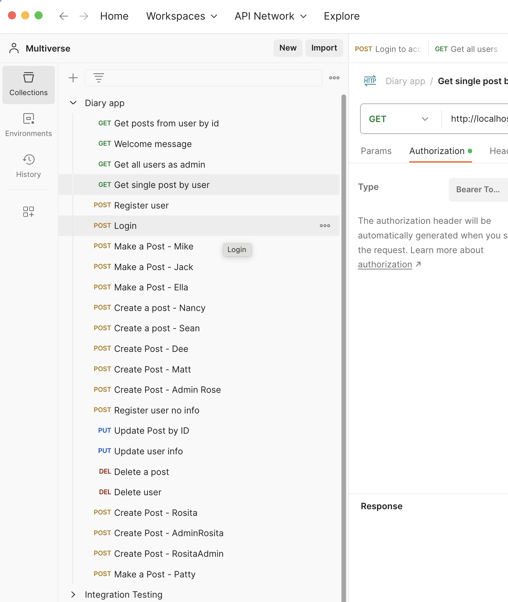
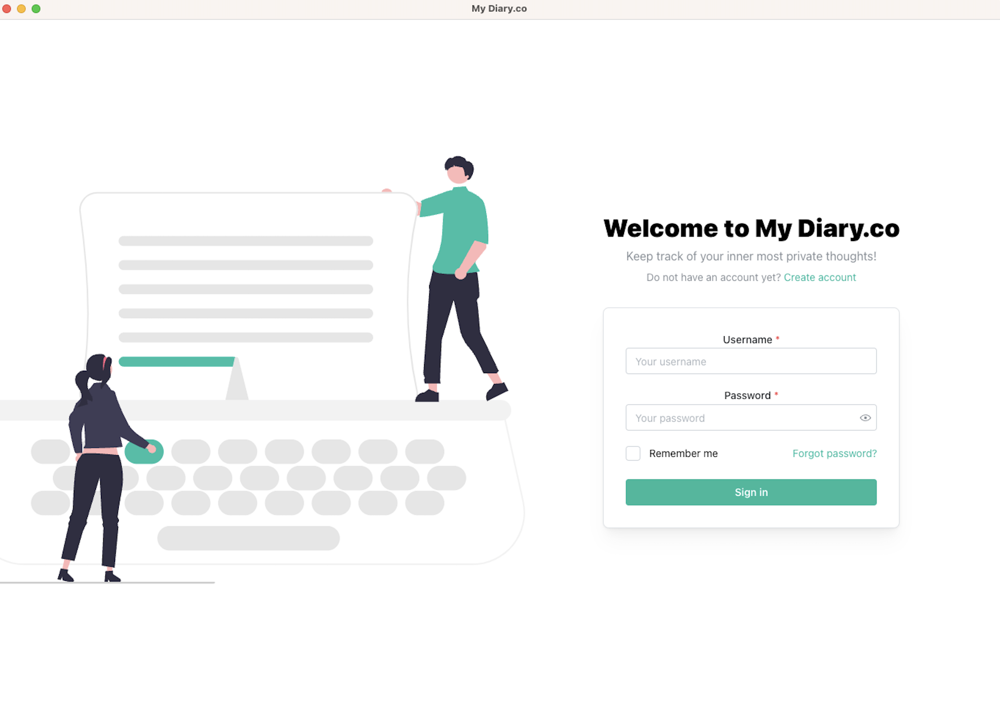
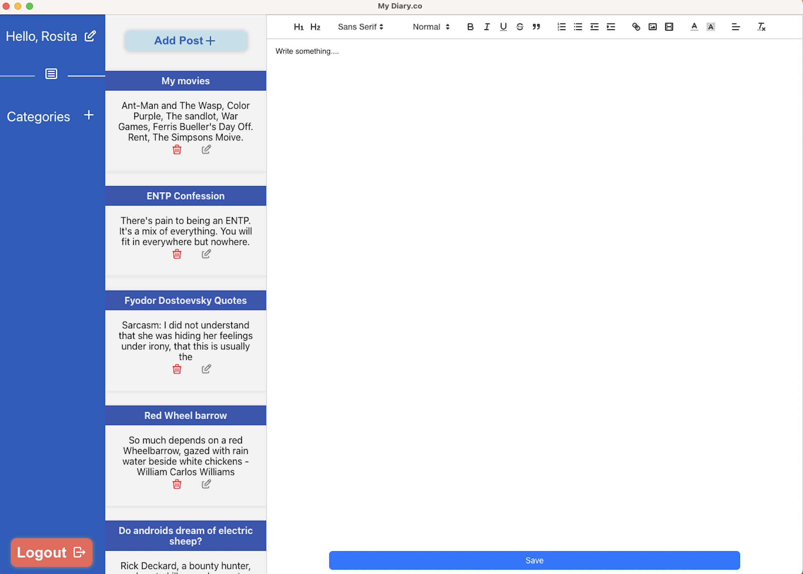

## Project #2 Backend
[Link to the repo](https://github.com/ejero/My-Diary)
### Overview
My Diary is a robust backend application built using JavaScript, Express, Sequelize, SQLite3, dotenv, and jsonwebtoken. This application is designed to provide a seamless diary management experience for users, enabling them to register an account, log in securely, create, view, edit, and delete posts, as well as update their user information. With an intuitive and efficient design, My Diary empowers users to organize their thoughts and experiences, facilitating a personalized and secure diary-keeping journey. Leveraging the power of Sequelize, the application ensures efficient data management and seamless user interaction, making it an essential tool for individuals seeking a reliable and secure platform to manage their personal content.

### Routes

### Log in 
  
### Diary Page
  

**What are the users?**  
The users of My Diary are individuals seeking a secure and user-friendly platform to document their personal thoughts, experiences, and reflections. This application caters to individuals from diverse backgrounds, including professionals, students, and anyone looking to maintain a private and organized digital diary. By providing a customizable and secure space for users to record their daily lives, My Diary aims to foster a sense of personal growth, reflection, and self-expression.

**What job does it form for them?**  
My Diary serves as a digital companion, enabling users to streamline their diary-keeping process and organize their personal narratives effortlessly. By offering features such as post creation, editing, and deletion, along with secure user account management, the application helps users maintain a private and secure digital diary space. Through simplified and intuitive interactions, My Diary facilitates the organization of personal content, allowing users to focus on self-reflection and the preservation of their memories in a convenient and secure manner.  

**What inspired you to make it?** 
I remember growing up with a little lockable notebook writing down my little childhood secrets. I wanted to create a digital version of that notebook that would allow users to keep their thoughts private and secure. I also wanted to create a platform that would allow users to easily organize their thoughts and experiences, thereby facilitating a seamless diary-keeping experience.

**What features are the most important?**  
The important features of My Diary include secure user authentication and authorization, seamless post management functionalities, and a user-friendly interface for an intuitive diary-keeping experience. The secure registration and login processes ensure the protection of user data, while the capability to create, view, edit, and delete posts empowers users to manage their diary entries efficiently. Additionally, the ability to update user information and delete user accounts provides users with complete control over their digital diary space, ensuring a personalized and secure experience.  

## Personal Contribution 
_I created the whole application, which includes user model, post model, and routes. I also created the user authentication and authorization middleware._

**S** - Take the diary idea and create a backend application that would allow users to create, view, edit, and delete posts. Also create a user model that would allow users to register and login securely. 

**T** - Eventhough I wrote this app by myself, I used Git and GitHub for source code management. I used JavaScript, Express, Sequelize, SQLite3, dotenv, and jsonwebtoken to create a backend application that would allow users to create, view, edit, and delete posts. Also create a user model that would allow users to register and login securely. Some of the tradeoffs I would say is the Scalability. Express, Sequelize, and SQLite3 are suitable for small to medium-scale applications, they might encounter limitations in handling extensive datasets or complex functionalities.   

**A** - I created a database to start my project with Sequelize. Then I created my user and post models. Finally I created my server and routes. I used Express to create my server and routes. I used middleware to set the user. I used jsonwebtoken to create my user authentication and authorization middleware. I used dotenv to hide my secret key. I used SQLite3 to create my database. This works well, but thee is an issue when I test the routes in Postman but I need to use the jwt token each time I test the routes. So I will need to make it so that the frontend will send the jwt token to the backend.

**R** - The result is a backend API application allows users to create, view, edit, and delete posts. The application also allows users to register and login securely. The application also allows users to update their user information and delete their user account. The routes work well in Postman but will need to be reworked a bit when I connect the frontend.  

## Technologies
- JavaScript
- Express
- Sequelize
- SQLite3
- dotenv
- jsonwebtoken
- Node v14 and above
- Git and GitHub

## Design and Architecture
 My Diary adopts a structured and modular approach, using the flexibility of the Express framework and Sequelize ORM to ensure a streamlined and efficient development process. The application's architecture prioritizes a separation of concerns, allowing for clear distinctions between the presentation layer which is in another file called client and data access layer. By incorporating RESTful API design principles, My Diary ensures a consistent and intuitive interaction between the client and server, facilitating smooth data transmission and manipulation. Additionally, the application leverages the power of Sequelize to ensure efficient data management.

## Competencies
### JF 1.6
### JOB FUNCTION 1.6: Can follow software designs and functional/technical specifications
This part was a bit easy as I created the software designs and functional/technical specifications, including the desired functionalities. I outlined my own project's requirements. For exmaple, I wanted the user to be able to create, view, edit, and delete posts. So I planed how the middleware would look like and then added my routes as planned. 

### JF 6.4
### JOB FUNCTION 6.4 Works independently and takes responsibility.					
During the development of My Diary project I demonstrated an exceptional ability to work independently and take full responsibility for the design and implementation process. I created the routes that I planned and I was able to test these routes in Postman. I was able to create the user authentication and authorization middleware. I was able to create the user model, post model was able to create the database, and the server. Since I was the sole owner of this project I had to closely monitoring each stage. I was able to scuccessfully complete the project and present it in time for the deadline. Through out this project I learned how to work independently and take full responsibility for the design and implementation process.