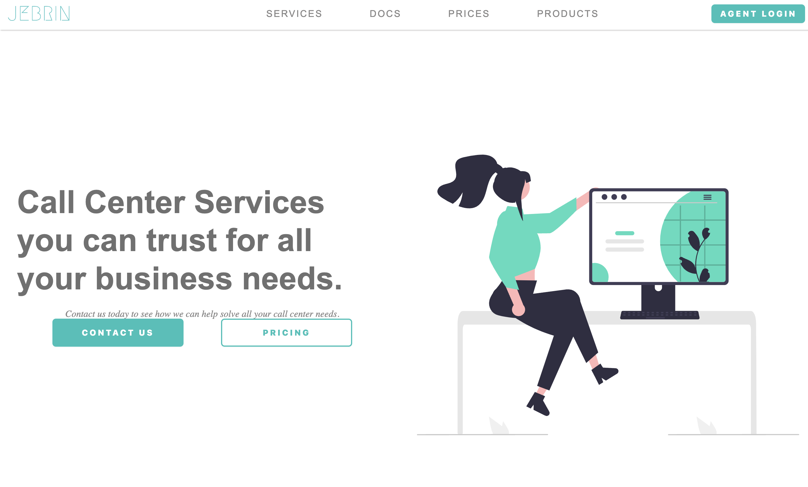
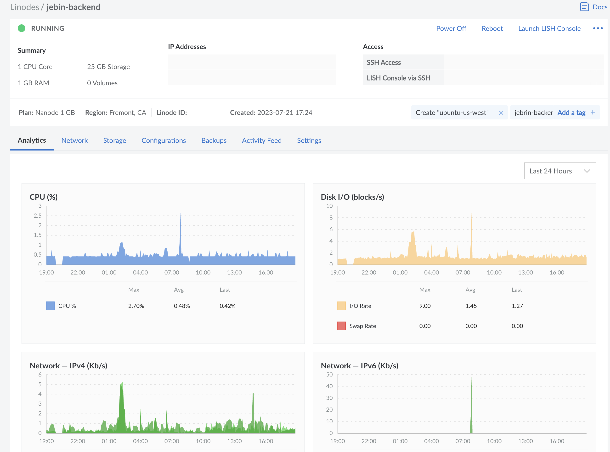

## Project #3

[Link to the frontend](https://github.com/ejero/Jebin-call)
[Link to the backend](https://github.com/ejero/Jebin-Backend)

### Overview

Jebin Call is a full-stack application that provides call center services for small businesses, allowing them to delegate customer call management efficiently. Built using JavaScript and React for the frontend, the application is deployed using Vercel with CI/CD integration through GitHub Actions. The backend, is deployed using Linode. And is powered by Express and Sequelize, ensures secure data handling with encrypted user authentication. With a focus on streamlining customer communication, Jebin Call simplifies the process for small businesses, enabling them to prioritize their core operations without compromising customer service.

### Home Page

### Linode Deployment

**What are the users?**  
The users of Jebin Call are primarily small business owners and their employees who seek to streamline and simplify their customer call management processes. These users benefit from the application's call center services, allowing them to delegate and manage customer calls efficiently without the need for extensive resources or dedicated call center infrastructure.

**What job does it form for them?**  
Jebin Call forms the crucial job of managing and handling customer calls for small businesses. It enables users to focus on their core business operations while ensuring that their customer communication remains efficient, secure, and well-organized. By automating and simplifying the process of call management, Jebin Call allows users to deliver exceptional customer service without the need for extensive manual intervention.

**What inspired you to make it?**  
I have always seen small companies that could use a call center to help manage their business. I thought it would be nice to try and implement a call center for small businesses. I wanted to create a user-friendly solution for small businesses that would allow them to manage their customer calls efficiently.

**What features are the most important?**  
The most important features is in my backend part where a user can login and register.

## Personal Contribution

_I created and styled the whole application frontend and backend parts._

**S** - Small business need to have the ability to take calls and keep records. The Jebin application needed to have the ability to login and register. The application needed to be able to simulate taking calls. This will help small business owners to keep track of their customers. When it came to tradeoffs, I had to abandon the VOIP phone part of the app. I had to focus on the login and register part of the app.

**T** Create a frontend with JavaScript, React and use an icon library for any needed icons to create a home page to welcome a small business owner. Create a backend to login , register and view all users. Although this app was made only by me use Git and GutHub for source code management. Display the frontend using Vercel and the backend using Linode.

**A** - I had a lot of challenges making this app since the app was made only by me. The biggest issue I had was trying to get the VOIP phone work. As time went by I had to abandon the VOIP part of the app. I was able to add a frontend home page and a login page, created with JavaScript, React and I used the icon library phosphor icons. As for the backend I used a database with Sqlite3 and used routes to login, register and view all users. I used Express and Sequelize to create the backend.

**R** - The frontend welcomes a small business owner and provides a bit of info of the company and allows a user to login. The backend has routes to allows a user to login, register and view all users. The completed version does need some improvements as a VOIP phone is needed to make the app work. I learned a lesson to not take on a project that is too big for one person. Also I learned not to focus on one feature for too long. I am happy that I was able to deploy the frontend using Vercel and the backend using Linode.

## Technologies

- React 18
- JavaScript
- Include dependencies and versions
- Git and GitHub
- Node
- Supertest
- Express
- Sequelize
- Sqlite3
- Vercel
- Linode

## Design and Architecture

Jebin Call is built with a streamlined architecture. The frontend, developed using JavaScript and React, ensures a user-friendly interface for smooth navigation. Leveraging Vercel for deployment and GitHub Actions for continuous integration, the frontend prioritizes efficiency. On the backend, Express and Sequelize enable secure data handling, with the application deployed on Linode. The testing with Supertest ensures that the application is robust and reliable. I used Express Router to manage routes, integrating middleware for user authentication.

## Competencies

### JF 3.6

### JOB FUNCTION 3.6: Can implement a RESTful API

Jebin Call integrates a RESTful API using Express and Sequelize on the backend. Clear and logically defined endpoints correspond to specific functionalities, such as user authentication and call management, following RESTful principles. Sequelize facilitates organized data handling, while comprehensive testing with tools like Jest and supertest validates the API's reliability and adherence to industry standards.

### JF 3.7

### JOB FUNCTION 3.7: Can implement authentication and authorization to an API.

Integration of middleware like bcrypt and jsonwebtoken ensures secure encryption and authentication. Using bcrypt for password encryption and jsonwebtoken for token-based authentication, the application ensures that user credentials remain encrypted and secure during transmission.
