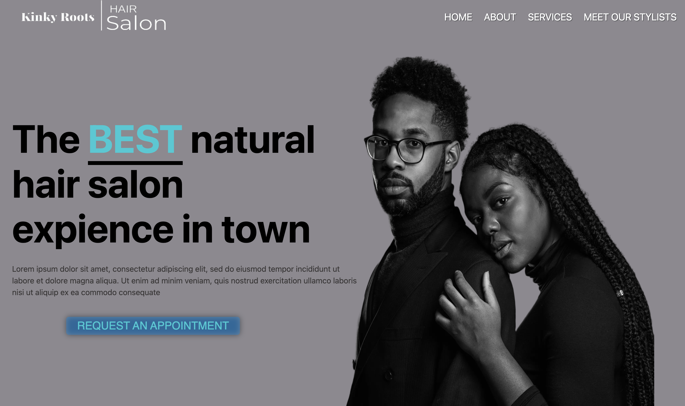
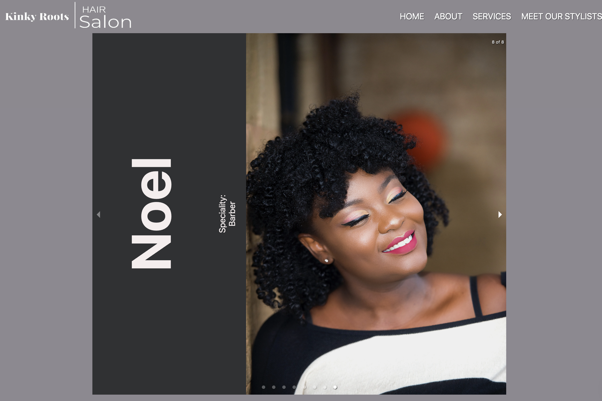

## Project #4 HackAThon

[Link to the repo](https://github.com/ejero/salon-project)
[Link to live app](https://www.kinkyroots.hair/)

### Overview

I built the Kinky Roots salon web app during a HackAThon using Next.js and JavaScript. I have is deployed and running on Vercel with my own domain name. The app lets users contact the salon to book appointments with a natural hair stylist through a simple contact form. Plus, there's a chat box that lets users have a real-time chat with Talk.js with salon staff. It was my first dive into Next.js, and I gotta say, it was worth it! The app benefits both salon owners and clients by offering a convenient and easy way to schedule appointments and helping salons provide better customer service.

### Home Page

## Stylists

**What are the users?**
The primary users of the application are individuals seeking to schedule appointments with a natural hair salon for various hair care services. These users could be anyone looking for a hassle-free and convenient way to book appointments and communicate with the salon's staff.

**What job does it form for them?**
The application simplifies the process of scheduling appointments and enhances communication between users and the salon's staff. By providing a user-friendly platform, it facilitates the booking of appointments, ensuring a smooth and efficient salon experience for customers.

**What inspired you to make it?**
I created this app because I have natural hair an thought it was would be nice to crate a simple website that simulated a customer sending a message to salon.
Recognizing the need for a seamless appointment booking process and improved communication, the aim was to develop an accessible platform that could cater to the modern-day requirements of scheduling appointments with a salon.

**What features are the most important?**
The most crucial feature of the application is the addition of a contact form that enables users to send messages directly to the salon. This functionality facilitates seamless communication between users and the salon's representatives, ensuring that inquiries, concerns, or appointment requests can be easily conveyed and addressed in a timely manner.

## Personal Contribution

_I created and styled the whole web application._

**S** -The application needed to have the ability to allow customers to view a home welcome page, send a message via a contact form and send a chat message in the chat pop up box. A User will also need to be able to see the details of the specialties of each stylists. Use a PocketBase for a open source backend.

**T** - This was a project I made myself so I needed to design all aspects. Since this is a HackAThon I had to learn a new Framework (Next.js), use JavaScript and deploy the application using Vercel. Keep track of the application with Git and GitHub. Since this is a HackAThon tradeoff will be not being able to create my own database having full control. So I had to use PocketBase.

**A** - I used the Next.js documentation to learn how to make an app with Next.js Framework. To get the contact form feature to work, I utilized Next.js to create a dynamic and responsive form that captures user input and enables seamless message transmission to the salon staff. I used PocketBase to save the user output backend. Leveraging my JavaScript skills, I implemented form validation to ensure data accuracy. Additionally, I optimized the form's layout and design for enhanced user experience, utilizing CSS to style the form.

**R** - The integration of the contact form feature within the app successfully facilitated direct communication between users and the salon staff, streamlining the appointment scheduling process. Leveraging Next.js and Vercel, I ensured a reliable and accessible platform for users to connect with the salon effortlessly. Although there were challenges initially in form layout and design, I successfully addressed them, resulting in a user-friendly and effective contact form. The one challenge I have is when the page initially loads.

## Technologies

- Next.js
- JavaScript
- PocketBase
- Talk.js
- Node v14
- Git and GitHub
- Include dependencies and versions

## Design and Architecture

Designed using JavaScript, Next.js and used PocketBase and Talk.js. Using the Next.js framework, the application's architecture follows a modular and component-based approach, making easy maintenance and scalability. The frontend was developed using JavaScript, incorporating modern design principles to create an aesthetically pleasing and responsive user interface. The integration of the contact form feature was strategically incorporated, allowing for smooth communication between users and the salon staff. Additionally, the application's architecture leverages Vercel's robust deployment capabilities, ensuring high performance and reliable accessibility. The use of CSS and Next.js styling features enabled the creation of a visually engaging and user-friendly interface, enhancing the overall user experience and promoting ease of use.

## Competencies

### JF 2.7

### JOB FUNCTION Effectively manages state for complex User Interfaces

In managing state, I organized the UI into manageable components. In my creation of the contact form the state of each fields was saved by using useState.

### JF 2.3

### JOB FUNCTION Can develop effective user interfaces

On the welcome page, I ensured a clear layout, making the contact form easily accessible with a prominent button, enhancing user engagement and streamlining the desired action. Furthermore, on the page featuring a carousel of different stylist, I focused on visual appeal and interactivity.
